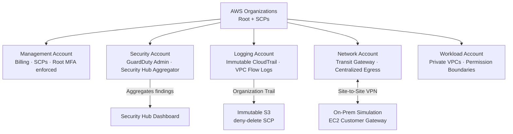

# Zero Trust Multi-Account AWS Security Architecture

> **Production-grade Zero Trust environment** simulating a real enterprise security posture across a multi-account AWS landing zone — with hybrid on-premises connectivity, centralized observability, and defense-in-depth at every layer.


**AWS Certified Solutions Architect – Associate (SAA-C03) | CCNA | fourth-year Cybersecurity Engineering Student, ENSA Oujda**

---

## What This Is

Most AWS environments are flat and over-permissioned — one compromised credential can cascade across the entire organization.

This project builds the opposite: a multi-account AWS environment where **every trust assumption is explicit, every permission is scoped to minimum viability, and every account is a hard boundary** — not a naming convention.

It directly answers the question recruiters and interviewers ask:

> *"Can you actually build secure cloud infrastructure — or just describe it?"*

This builds directly on my previous [CCNA Enterprise Hybrid Networking Lab](https://github.com/ilyas-360/AWS-Cloud-Security-Foundations).

---

## Architecture Overview



| Account | Purpose | Key Controls |
|---|---|---|
| **Management** | Billing, Organizations, SCP enforcement | Root MFA enforced, no workloads run here |
| **Security** | GuardDuty delegated admin, Security Hub aggregator | Read-only access across all accounts |
| **Logging** | Immutable CloudTrail, VPC Flow Logs | Deny-delete SCP on S3 — attackers cannot erase logs |
| **Network** | Transit Gateway, centralized egress | No internet gateway in workload accounts |
| **Workload** | Application resources | Permission boundaries on all roles, private subnets only |

> Full account strategy and OU design: [docs/01-account-strategy.md](docs/01-account-strategy.md)

---

## Zero Trust Pillars

| Pillar | Implementation |
|---|---|
| **Never trust, always verify** | MFA + `aws:PrincipalOrgID` enforced on every cross-account role assumption |
| **Least privilege everywhere** | Permission boundaries cap maximum permissions on all workload roles |
| **Assume breach** | Blast radius contained per account — compromised workload cannot touch logging or security tooling |
| **Just-in-time access** | Role sessions capped at 1 hour — no persistent credentials, no long-lived access keys |
| **Continuous verification** | GuardDuty + CloudTrail + Security Hub aggregating findings across all accounts in real time |

> Deep dive: [docs/04-zero-trust-pillars.md](docs/04-zero-trust-pillars.md)

---

## Key Security Controls

### Service Control Policies (SCPs)
Hard guardrails at the OU level — cannot be overridden by any account, including root:

| Policy | Threat Closed |
|---|---|
| `deny-root-usage.json` | Blocks all API calls from root credentials |
| `deny-disable-cloudtrail.json` | Makes the audit trail immutable — attackers cannot erase their tracks |
| `deny-region-restriction.json` | Restricts all activity to approved regions |
| `enforce-imdsv2.json` | Forces IMDSv2 on EC2 — eliminates SSRF-to-credential-theft attacks |

> Annotated policy files: [policies/scps/](policies/scps/)

### IAM Architecture
- **Permission boundaries** cap maximum permissions on every workload role — closes IAM privilege escalation paths
- **Role assumption chains** replace direct IAM user access — no persistent access keys anywhere
- **Cross-account trust** scoped with `aws:PrincipalOrgID` — external accounts categorically excluded

> Role assumption chain walkthrough: [docs/03-iam-design.md](docs/03-iam-design.md)

### Network Micro-Segmentation
- Workload VPCs have **no public subnets** — all egress routes through centralized NAT in Network account
- Security Groups as stateful primary control, NACLs as stateless backstop
- Transit Gateway with per-account route table isolation — workload accounts cannot reach each other directly

### Hybrid Connectivity
On-premises simulated via EC2 customer gateway connected through **Site-to-Site VPN** to Transit Gateway in the Network account — replicating the real enterprise pattern of controlled, audited hybrid access.

> VPN configuration and routing: [docs/05-hybrid-connectivity.md](docs/05-hybrid-connectivity.md)

### Observability & Detection

```
All Accounts
    │
    ├── CloudTrail (Organization Trail) ──────► Immutable S3 (Logging Account, deny-delete SCP)
    │
    ├── GuardDuty (delegated admin) ──────────► Security Account (aggregated findings)
    │                                                │
    ├── VPC Flow Logs ───────────────────────────────┤
    │                                                ▼
    └── AWS Config ──────────────────────────────► Security Hub Dashboard
```

Key design principle: **detection that can be disabled by an attacker is not detection.** GuardDuty findings aggregate to the Security account — a compromised workload account cannot suppress them.

> Detection scenarios and findings: [docs/06-security-observability.md](docs/06-security-observability.md)

---

## Implementation Status *(April 2026 — Actively Building)*

| Component | Status | Notes |
|---|---|---|
| Account structure + OU design | ✅ Complete | Diagrams finalized |
| SCP policies (4 core guardrails) | ✅ Complete | Annotated JSON in `policies/scps/` |
| IAM permission boundaries | 🔄 In Progress | Terraform module started |
| VPC + micro-segmentation | 🔄 In Progress | Private-only topology designed |
| Transit Gateway + routing | 🔄 In Progress | Per-account route tables designed |
| Site-to-Site VPN | 🔄 In Progress | Configuration documented |
| GuardDuty + Security Hub | 🔄 In Progress | Delegated admin design complete |
| CloudTrail organization trail | 🔄 In Progress | Logging account target configured |
| Terraform IaC modules | 🔄 In Progress | Organizations module started |
| Verification + screenshots | 🔄 In Progress | Added daily as I deploy |
| GitHub Actions CI | 📋 Planned | `terraform plan` on PR |
| 10x scale extensions | 📋 Planned | Control Tower, IPAM, Network Firewall |

Daily updates pushed as Terraform modules are completed and deployment screenshots are added.

---

## Quick Start

```bash
git clone https://github.com/ilyas-360/zero-trust-aws.git
cd zero-trust-aws

# Start with the architecture
cat docs/01-account-strategy.md

# Review security controls
ls policies/scps/

# Explore Terraform modules
cd terraform/modules/
```

> **Terraform deployment** in progress — full `terraform plan` output expected by end of April 2026.
> **Cost note:** Resources are spun up for validation and destroyed immediately. The value is in reproducible IaC.

---

## What I Would Change at 10x Scale

> Full analysis: [docs/07-scale-tradeoffs.md](docs/07-scale-tradeoffs.md)

At 50+ accounts, several manual processes become bottlenecks:

- **AWS Control Tower** — automated account vending, new accounts from template in minutes
- **IAM Identity Center** — single SSO entry point with permission sets replacing manual role chains
- **Centralized IPAM** — automated CIDR allocation across hundreds of VPCs with no overlap
- **AWS Network Firewall** — deep packet inspection at egress VPC, replacing Security Group-only controls
- **Delegated administration** — every security service operated independently from the Security account

---

## Repository Structure

```
zero-trust-aws/
├── diagrams/               # Architecture visuals (PNG + draw.io source)
├── terraform/
│   ├── modules/            # organizations · iam · networking · security · logging
│   └── environments/       # management · security · logging · network · workload
├── policies/
│   ├── scps/               # Annotated SCP JSON files
│   ├── iam/                # Permission boundaries + role assumption chains
│   └── vpc/                # NACL rules
├── docs/                   # Numbered design decisions (01 → 07)
├── verification/           # Screenshots, test results, GuardDuty findings
└── .github/workflows/      # CI — terraform plan on PR (coming)
```

---

## Author

**Ilyas Benkhadra**
Final-year Cybersecurity Engineering student, ENSA Oujda
Specialization: Cloud Security Engineering

**AWS Certified Solutions Architect – Associate (SAA-C03)** | March 2026
**CCNA** | Enterprise hybrid networking foundation
📍 Morocco — Open to Summer 2026 internships in Cloud Security, DevSecOps, Infrastructure Security

Previous project: [AWS-Cloud-Security-Foundations](https://github.com/ilyas-360/AWS-Cloud-Security-Foundations) — CCNA Enterprise Hybrid Lab

[](https://linkedin.com/in/YOUR_LINKEDIN)
[](https://github.com/ilyas-360)
